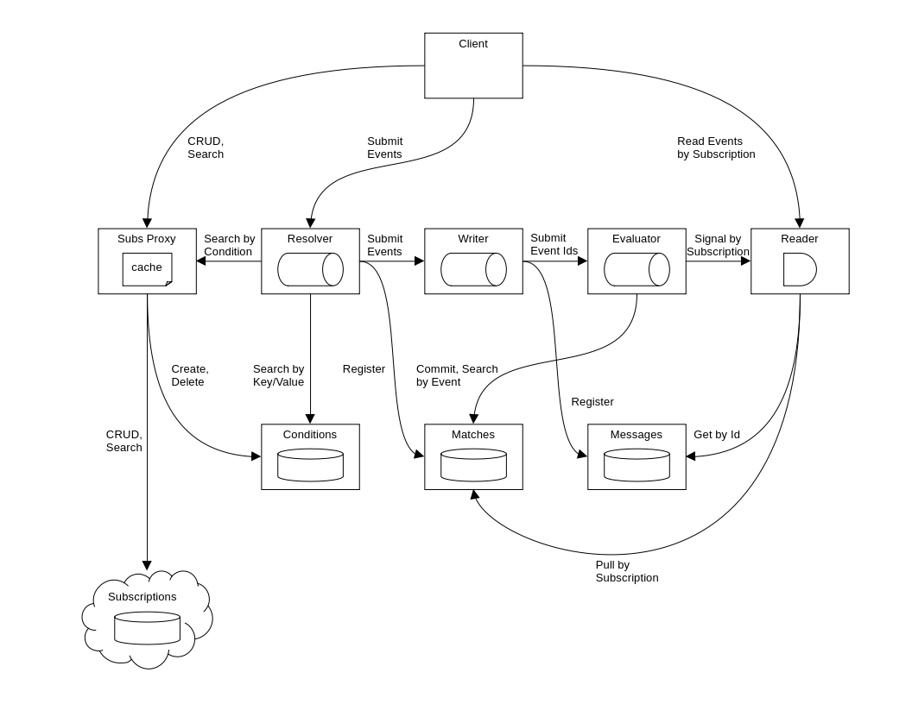
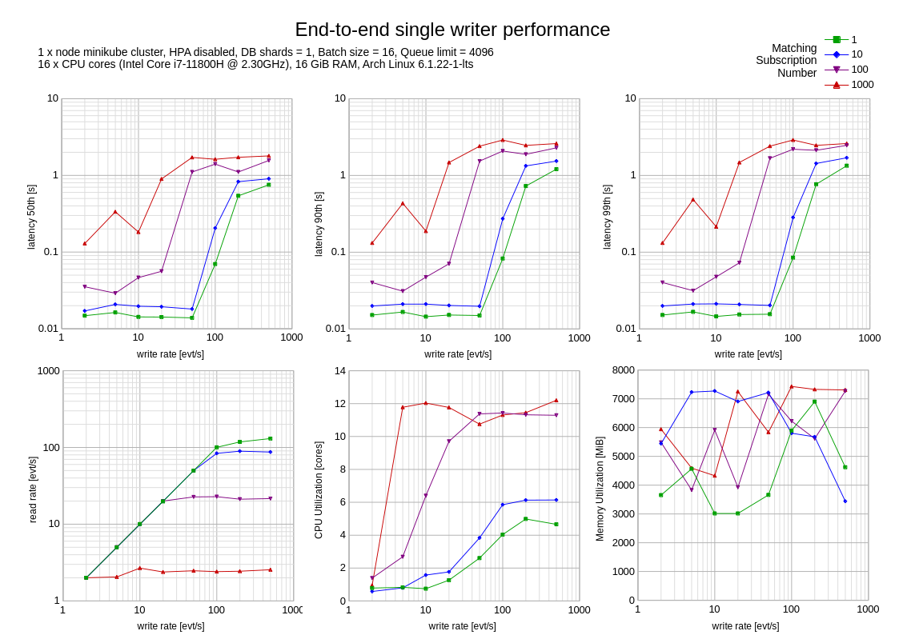

# Contents

1. [Overview](#1-overview)<br/>
2. [Configuration](#2-configuration)<br/>
3. [Deployment](#3-deployment)<br/>
4. [Usage](#4-usage)<br/>
5. [Design](#5-design)<br/>
6. [Contributing](#6-contributing)<br/>
   6.1. [Versioning](#61-versioning)<br/>
   6.2. [Issue Reporting](#62-issue-reporting)<br/>
   6.3. [Building](#63-building)<br/>
   6.4. [Testing](#64-testing)<br/>
   &nbsp;&nbsp;&nbsp;6.4.1. [Functional](#641-functional)<br/>
   &nbsp;&nbsp;&nbsp;6.4.2. [Performance](#642-performance)<br/>
   6.5. [Releasing](#65-releasing)<br/>


# 1. Overview

This repo contains the Helm chart for the Awakari core system deployment.
The core doesn't include subscriptions storage. 
To run the core system on own premises, request access to the cloud instance of subscriptions storage.

# 2. Configuration

For a component-specific options see the corresponding sub-chart configuration. Here follow own configuration options: 

| Variable               | Default | Description                                                                                                              |
|------------------------|---------|--------------------------------------------------------------------------------------------------------------------------|
| mongodb.internal       | `true`  | Defines whether to deploy the MongoDB internally or use external one.                                                    | 
| queue.backend.nats     | `true`  | Enables the NATS JetStream queue wrapper service. Exclusive, can not be used together with other queue backends.         |
| semaphore.backend.nats | `true`  | Enables the NATS-based distributed semaphore service. Exclusive, can not be used together with other semaphore backends. |
| tracing.enabled        | `false` | Enables the distributed tracing, internal Jaeger and Cassandra deployment as well to collect the spans.                  | 

# 3. Deployment

There are the following resources required:
1. Own K8s cluster
2. Cloud subscriptions service access

## 3.1. Own Cluster Preparation

Create the target namespace:
```shell
kubectl create namespace awakari
```

Request and use the public GitHub registry access token to pull Awakari images:
```shell
docker login ghcr.io -u akurilov -p <ACCESS_TOKEN>
```

Create the image pull secret:
```shell
kubectl create secret generic github-registry \
    -n awakari \
    --from-file=.dockerconfigjson=<home/.docker/config.json> \
    --type=kubernetes.io/dockerconfigjson
```

## 3.2. Cloud Subscriptions

Using cloud subscriptions requires mutual TLS authentication and encryption to secure the client subscriptions data.
To access the cloud subscriptions it's necessary to have a client certificate.

> [!IMPORTANT]
>
> Cloud subscriptions doesn't have any access to events data being processed by the core system.

For the demo purposes, there is the cloud instance `demo.subscriptions.awakari.cloud` available.
Ready-to-use demo client certificates are in the [certs/demo](certs/demo) directory.

For production usage, prepare own client certificate request:
```shell
openssl req -new -newkey rsa:4096 -nodes \
  -keyout client.key \
  -out client.csr \
  -addext "subjectAltName=DNS:subscriptions.awakari.cloud" \
  -subj '/CN=group0.company1.com'
```

> **Warning**
>
> Never specify additional certificate attributes like "O", "OU", etc.
> The resulting DN should not contain commas.

Then request the client certificate.

After the client certificate (`client.crt`) is received, create a pair of cluster secrets:
```shell
kubectl create secret generic -n awakari secret-subscriptions-tls-client-key --from-file=client.key
kubectl create secret generic -n awakari secret-subscriptions-tls-client-crt --from-file=client.crt
```

## 3.3. Core Installation

Install the package:
```shell
helm repo add awakari-core https://awakari.github.io/core
helm install core core-0.0.0.tgz -n awakari
```

> **Warning**
> 
> Do not change the "core" release name

To connect the core system to the demo cloud subscriptions, override the address:
```shell
helm install core core-0.0.0.tgz -n awakari \
  --set subscriptionsproxy.api.subscriptions.uri=demo.subscriptions.awakari.cloud:443
```

## 3.4. Cloud MongoDB

> [!NOTE]
>
> This step is optional, by default the core system comes with internal MongoDB sharded cluster.

To use external MongoDB, use the values file [values-mongodb-ext.yaml](helm/core/values-mongodb-ext.yaml) for the 
reference and substitute these with own values.

```shell
helm install core core-0.0.0.tgz -n awakari --values values-mongodb-ext.yaml
```

# 4. Usage

## 4.1. Client SDK

Refer to [Client SDK Usage](https://github.com/awakari/client-sdk-go#3-usage).

> [!NOTE]
>
> Usage Limits and Permits APIs are not available in the Core.

## 4.2. API

### 4.2.1. Preparation

1. Install [grpcurl](https://github.com/fullstorydev/grpcurl)
2. Download the necessary proto files and save to the current directory:
   1. [Cloud Events](https://awakari.com/proto/cloudevent.proto)
   2. [Reader](https://awakari.com/proto/reader.proto)
   3. [Resolver](https://awakari.com/proto/resolver.proto)
3. Port-forward services to local:
   1. `core-reader` -> 50051
   2. `core-resolver` -> 50052
   3. `core-subscriptionsproxy` -> 50053

### 4.2.2. Subscriptions

Create:
```shell
grpcurl \
  -plaintext \
  -H 'X-Awakari-User-Id: john.doe@company1.com' \
  -d @ \
  localhost:50053 \
  awakari.subscriptions.proxy.Service/Create
```

Example payload:
```json
{
   "description": "Tesla model S updates",
   "enabled": true,
   "cond": {
      "not": false,
      "tc": {
        "key": "",
        "term": "Tesla Model S",
        "exact": false
      }
    }
}
```

A successful response contains the created subscription id:
```json
{
  "id": "547857e3-adfc-48a5-a49e-110cfdedbaab"
}
```

Note the created subscription id and use it further to read the messages.
Learn more about the [Subscriptions API](https://github.com/awakari/client-sdk-go/blob/master/api/grpc/subscriptions/service.proto).

### 4.2.3. Read Events

```shell
grpcurl \
  -plaintext \
  -proto reader.proto \
  -max-time 86400 \
  -H 'X-Awakari-User-Id: john.doe@company1.com' \
  -d @ \
  localhost:50051 \
  awakari.reader.Service/Read
```

Specify the subscription id in the payload:
```json
{"start": {"batchSize": 1, "subId": "547857e3-adfc-48a5-a49e-110cfdedbaab"}}
```

This starts a reader stream. A new event appear in the response once system receives anything matching the subscription. 
Leave this shell/window open and switch to another. Later switch back and check for new events received.

It's necessary to acknowledge every received message:
```json
{"ack": { "count": 1}}
```

### 4.2.4. Write Events

```shell
grpcurl \
  -plaintext \
  -proto writer.proto \
  -H 'X-Awakari-User-Id: john.doe@company1.com' \
  -d @ \
  localhost:50052 \
  awakari.resolver.Service/SubmitMessages
```

Specify the events to write in the payload:
```json
{
   "msgs": [
      {
         "id": "3426d090-1b8a-4a09-ac9c-41f2de24d5ac",
         "type": "example.type",
         "source": "example/uri",
         "spec_version": "1.0",
         "attributes": {
            "subject": {
               "ce_string": "Tesla price updates"
            },
            "time": {
               "ce_timestamp": "2023-07-03T23:20:50.52Z"
            }
         },
         "text_data": "Tesla model S is now available at lower price"
      }
   ]
}
```

A successful response looks like:
```json
{
  "ackCount": 1
}
```

After this it's possible to submit more messages.

When finished, close the writer stream by pressing ^C or leave it open to publish any other messages later.

# 5. Design

The core of Awakari consist of:
* Stateful components
  * Conditions, e.g. [Text](https://github.com/awakari/conditions-text)
  * [Matches](https://github.com/awakari/matches)
  * [Messages](https://github.com/awakari/messages)
* Stateless components
  * [Subscriptions-Proxy](https://github.com/awakari/subscriptions-proxy)
  * [Reader](https://github.com/awakari/reader)
  * [Evaluator](https://github.com/awakari/evaluator)
  * [Writer](https://github.com/awakari/writer)
  * [Resolver](https://github.com/awakari/resolver)
* 3-rd part components
  * Mongodb (sharded)
  * Redis in-memory cache
  * NATS message bus



# 6. Contributing

## 6.1. Versioning

The service uses the [semantic versioning](http://semver.org/).
The single source of the version info is the git tag:
```shell
git describe --tags --abbrev=0
```

## 6.2. Issue Reporting

TODO

## 6.3. Building

Build a helm package:
```shell
for i in core conditions-text evaluator matches messages queue-nats reader resolver subscriptions-proxy semaphore-nats writer; do git clone git@github.com:awakari/$i.git; done
cd core
helm dependency update helm/core
helm package helm/core
```

## 6.4. Testing

### 6.4.1. Functional

The repo contains core functional end-to-end tests.

To run the tests locally:

1. Port-forward the reader API to local port 50051
2. Port-forward the resolver API to local port 50052
3. Port-forward the subscriptions API to local port 50053
4. 
```shell 
make test
```

To run the tests in K8s cluster:
```shell
helm test core -n awakari --filter name=core-test
```

### 6.4.2. Performance



## 6.5. Releasing

To release a new version (e.g. `1.2.3`) it's enough to put a git tag:
```shell
git tag -v1.2.3
git push --tags
```

The corresponding CI job is started to build a helm chart and publish it with the specified tag (+latest).
